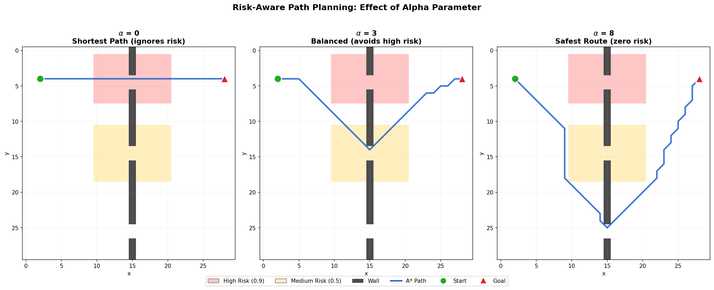
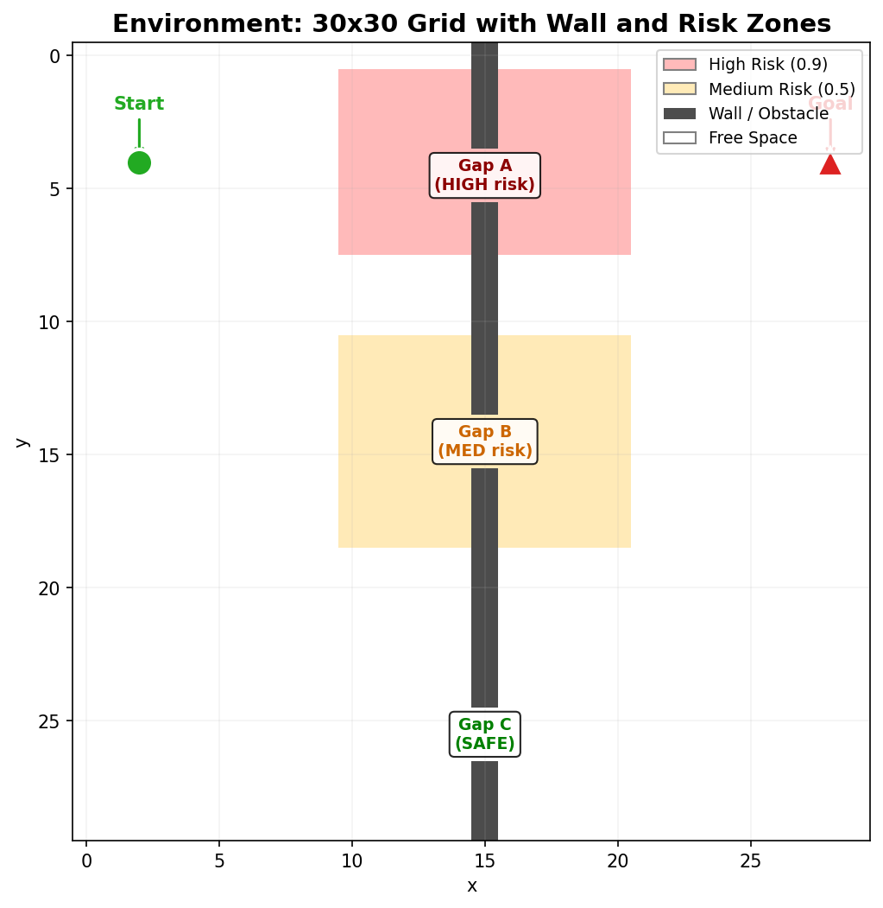

# Risk-Aware Path Planner

A C++ path planner that finds routes on a 2D grid while considering risk. Implements **A\*** and **RRT\*** with a tunable `alpha` parameter that controls the trade-off between path length and risk exposure - a core problem in autonomous vehicle decision-making.



## Motivation

In real-world autonomous navigation, the shortest path isn't always the best. A route through a construction zone or a pedestrian-heavy area might save time but carries higher risk. This project explores that trade-off: by adjusting a single parameter, the planner shifts from pure shortest-path to strongly risk-averse behavior.

The environment is a 30×30 grid with a vertical wall that has three gaps, each surrounded by a different risk level. The planner must choose which gap to cross based on the `alpha` setting.



## Results

| Alpha | Route Chosen | A\* Cost | Risk Exposure | Behavior |
|-------|-------------|----------|---------------|----------|
| 0 | Gap A (y=4-5) | 26.00 | 9.90 | Shortest path, straight through high-risk zone |
| 3 | Gap B (y=14-15) | 44.78 | 3.50 | Avoids high risk, accepts medium risk |
| 8 | Gap C (y=25-26) | 52.77 | 0.00 | Long detour through the safe corridor |

As `alpha` increases, the planner trades distance for safety. See [`examples/sample_output.txt`](examples/sample_output.txt) for full terminal output.

## How It Works

### Cost Function

The key idea is adding a risk penalty to the movement cost:

```
f(n) = g(n) + h(n)

g(n) = g(parent) + move_cost + alpha * risk(n)
h(n) = Euclidean distance to goal

move_cost = 1.0 (cardinal) or sqrt(2) (diagonal)
risk(n)   = cell risk value in [0.0, 1.0]
```

When `alpha = 0`, risk is ignored and A\* finds the shortest path. As `alpha` grows, stepping on risky cells becomes increasingly expensive, forcing the planner to find safer alternatives.

### Algorithms

**A\*** - Graph-based search with 8-connected movement (cardinal + diagonal). Uses a priority queue ordered by `f = g + h`. The risk-weighted step cost makes it prefer low-risk routes when alpha is high.

**RRT\*** - Sampling-based planner that builds a random tree toward the goal. Key extensions over basic RRT:
- **Cost-aware nearest selection**: picks the nearest node using `score = distance + 0.3 * node_cost`, so it biases toward low-cost branches instead of just proximity
- **Rewiring**: after adding a new node, checks nearby nodes and reparents them if routing through the new node is cheaper
- **Bresenham collision checking**: uses integer-based line drawing for fast obstacle detection
- **Goal-biased sampling**: 15% of samples target the goal directly

**Path Smoothing** - Post-processing step that removes unnecessary waypoints using shortcut optimization. When `alpha > 0`, it rejects shortcuts that would pass through higher-risk zones than the original path, preserving the risk-avoidance behavior.

### Environment

- 30×30 grid with a vertical wall at x=15
- **Gap A** (y=4-5): surrounded by risk 0.9 - closest to start/goal
- **Gap B** (y=14-15): surrounded by risk 0.5 - medium distance
- **Gap C** (y=25-26): risk-free - farthest detour
- Start: (2, 4), Goal: (28, 4)

## Build & Run

### Requirements

- C++17 compiler (GCC, Clang, or MSVC)
- CMake 3.14+

### Build

```bash
mkdir build && cd build
cmake ..
make
```

On Windows with MinGW:
```bash
cmake .. -G "MinGW Makefiles"
mingw32-make
```

### Run

```bash
./planner                # default alpha = 1.0
./planner --alpha 0      # pure shortest path
./planner --alpha 3      # balanced
./planner --alpha 8      # strongly risk-averse
./planner --help
```

### Generate Visualizations

```bash
pip install matplotlib numpy
python scripts/visualize.py
```

## Project Structure

```
├── CMakeLists.txt
├── src/
│   ├── main.cpp           - environment setup, CLI parsing, runs both algorithms
│   ├── grid.h / grid.cpp  - grid representation, obstacle & risk maps, line checks
│   ├── astar.h / astar.cpp - A* with 8-connected movement and risk-weighted cost
│   ├── rrt.h / rrt.cpp    - RRT* with rewiring, cost-aware nearest, Bresenham LOS
│   └── smoothing.h / .cpp - risk-aware shortcut path smoothing
├── scripts/
│   └── visualize.py       - generates comparison plots with matplotlib
├── examples/
│   └── sample_output.txt  - terminal output for alpha = 0, 3, 8
└── docs/
    ├── environment.png
    └── alpha_comparison.png
```

## Possible Extensions

- Dynamic/time-varying risk zones
- Larger grids or real map data (e.g. OpenStreetMap)
- Additional algorithms (D\*, Theta\*, Hybrid A\*)
- Multi-objective optimization (Pareto front for cost vs. risk)
- 3D grid extension for UAV path planning

## License

MIT - see [LICENSE](LICENSE)
